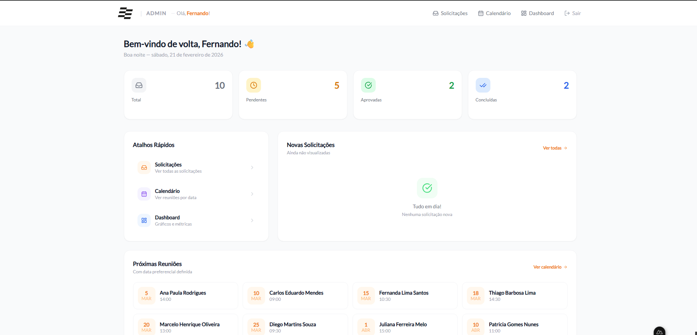

# ⚙️ Field Industrial

*Full-stack industrial engineering platform with admin panel, meeting scheduling and technical management.*

*Plataforma completa de engenharia industrial com painel administrativo, agendamento de reuniões e gestão técnica.*

---

## 📸 Screenshots

---

## 🚀 Features / Funcionalidades

### 🌐 Institutional Website / Site Institucional
- Animated hero with interactive particles / Hero animado com partículas interativas
- Pages: About, Values, Services, Projects / Páginas: Quem Somos, Valores, Serviços, Projetos
- Meeting scheduling form / Formulário de agendamento de reunião
- Scroll reveal animations and responsive layout / Animações de scroll reveal e layout responsivo

### ⚙️ Admin Panel / Painel Administrativo
- Dashboard with metrics and charts / Dashboard com métricas e gráficos
- Requests with filters, search and sorting / Solicitações com filtros, busca e ordenação
- Real-time notifications with sound / Notificações em tempo real com som
- Assignee management per request / Atribuição de responsável por solicitação
- Internal notes per request / Notas internas por solicitação
- Automatic emails to client / E-mails automáticos ao cliente
- Meeting calendar / Calendário de reuniões
- JWT authentication with multiple admins / Autenticação JWT com múltiplos admins

---

## 🛠️ Stack

| Layer / Camada | Technology / Tecnologia |
|----------------|------------------------|
| Framework | Nuxt.js 3 |
| Language / Linguagem | TypeScript |
| Styling / Estilização | Tailwind CSS 3 |
| Database / Banco de Dados | MySQL 8 |
| Auth / Autenticação | JWT |
| Email / E-mail | Nodemailer |
| Charts / Gráficos | Chart.js |

---

⚙️ *Engineering with excellence and precision / Engenharia com excelência e precisão* — **Field Industrial**

